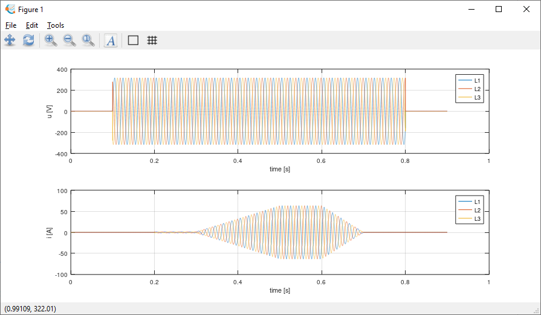

# Simulator of EV charger input waveform for EPM project 23IND06 Met4EVCS

This project is generator of multiphase voltage and current waveforms simulating grid to EV charger AC inputs. It is part of European [EPM](https://www.metpart.eu) project [23IND06 Met4EVCS](https://www.vsl.nl/en/met4evcs/).
Intention of this simulator is to generate waveforms carrying known energy that can be used to numerically verify function of power/energy metering algorithms under conditions close to real measurements.
It can generate multiphase waveforms with defined voltage, current, PF, harmonics, suprahamonics, etc. It can also apply frequency dependent model of voltage and current transducers and digitizers which can be used to verify
metering algorithms corrections. It can also randomize the model which can be used to evaluate uncertainty using Monte Carlo method.

It is developed for environments [GNU Octave](https://octave.org) and [Matlab](https://www.mathworks.com/products/matlab.html). It should work in both.
For more details see main function `sim_evcs.m` or demo `simtest.m`.

## Status
At this point, it is mostly a generic parametric waveform simulator as not enough measured data from real chargers is available yet.
It will be extended in future by some presets for some specific EV charger and EV combination(s).
Only part based on so far measured data is generator of supraharmonics (spurs over some 2 kHz).

## License
The simulator is distributed under [MIT license](./LICENSE.txt). 
